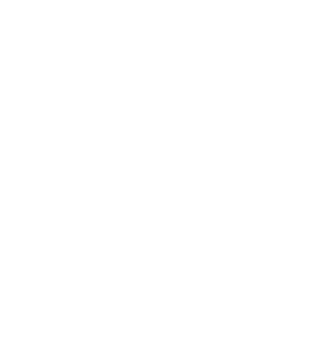
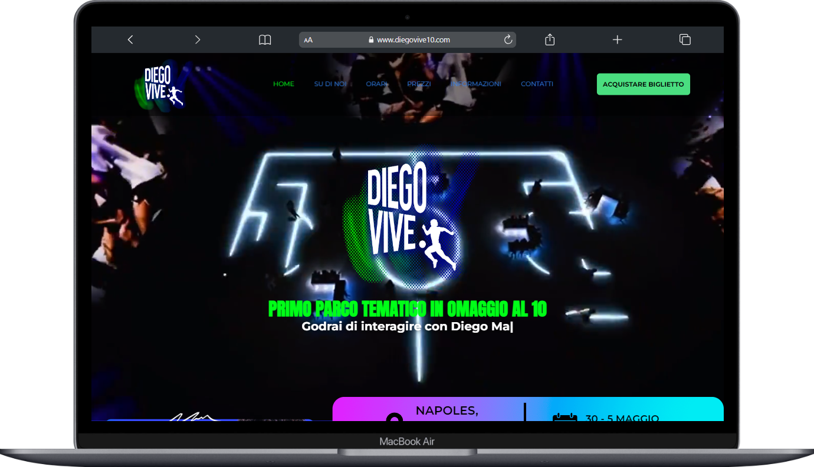
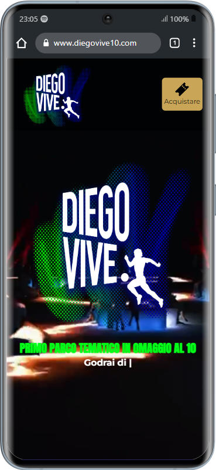

  

<h1 align="center">Diego Vive</h1>

Diego Vive es un parque temático dedicado a unos de los mejores futbolistas de todos los tiempos, Diego Armando Maradona.

 

## Información destacada del sitio

- Detalles del evento: Obtene información detallada sobre la hora, fecha, lugar, actividades y precios.
- Compra de entradas: Permite a los redirigir a los usuarios a la compra de boletos fácilmente.
- Actividades a realizar: Cuenta con información sobre los eventos que se realizan en el parque.

 

### Capturas de Pantalla de la Web

 

 

 

### :diamond_shape_with_a_dot_inside: Levantar Proyecto

> [!NOTE]
> Crea una carpeta en tu pc y dentro del directorio escibe los siguientes comandos

- Clonar proyecto
    
    git clone https://github.com/Nachorojo2015/Diego-Vive.git

- Instalar dependencias

    npm install

- Levantar proyecto

    npm run dev

> [!TIP]
> Recuerda tener instalado [NODEJS](https://nodejs.org/en) para poder ejecutar los comandos

### :hammer: Stack Utilizado

- [Astro](https://astro.build/)
- [Tailwind CSS](https://tailwindcss.com/)

